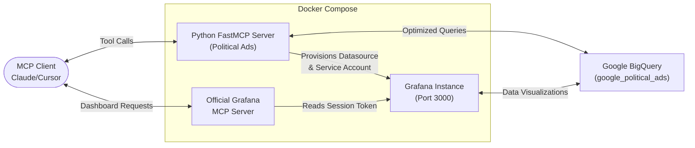

# Data Analyzer

**Political Ads Intelligence Hub & MCP Server**

An intelligent Model Context Protocol (MCP) and visualization pipeline for Google's public Political Ads transparency dataset (`bigquery-public-data.google_political_ads.creative_stats`) utilizing Google BigQuery and the official Grafana MCP server.

[Read the Setup Guide](SETUP.md){ .md-button .md-button--primary }
[See the Architecture](ARCHITECTURE.md){ .md-button }
[Watch the Demos](demos.md){ .md-button }

---

## 🏛️ Architecture Overview

The system is split into two synchronized, high-performance services orchestrated via Docker Compose:

* **Political Ads MCP Server (`src/server.py`)**:
    * A Python-based `FastMCP` application exposing optimized, specialized BigQuery tools.
    * Restricts LLM token usage by avoiding raw SQL spikes, utilizing targeted datasets (`get_top_advertisers`, `search_advertiser_ads`).
    * Automatically provisions a **BigQuery datasource** inside Grafana on boot.
    * Features a background boot-hook (`ensure_grafana_service_account`) that polls Grafana, auto-provisions an Admin Service Account (`mcp-sa`), generates a token, and writes it persistently to a shared volume.

* **Official Grafana MCP Server (`grafana/mcp-grafana`)**:
    * Runs alongside Grafana to provide standard Model Context Protocol capabilities.
    * Automatically loads the persistently provisioned Service Account Token on boot via a resilient entrypoint loop.
    * Enables any MCP client (such as Claude Desktop, Cursor, or Zed) to query all configured datasources (like BigQuery), search, build, patch, and export visual Grafana dashboards dynamically.

## How it fits together

Full technical details and design rationale are in [Architecture](ARCHITECTURE.md).

## 🚀 Quick Start (Docker Deployment)

The fastest way to deploy the entire stack is using Docker Compose, which boots Grafana, the Python MCP server, and the official Grafana MCP server in total synchronization.

* **Place your GCP Credentials**: Rename your Service Account JSON key to `gcp-creds.json` and save it in the root of this project.
* **Start the containers**: Run `docker compose -f deploy/docker-compose.yml up --build -d`
* **What happens under the hood**:
    * **Grafana** starts up, pre-installs the `grafana-bigquery-datasource` plugin, and enables anonymous Admin access on port `3000`.
    * The **Python MCP Server** boots, extracts credentials, provisions BigQuery datasources, and writes the `mcp-sa` token to the shared `mcp-config/token` volume.
    * The **Grafana MCP Container** waits for the token file, loads it dynamically, and runs on port `8000`.
* **Access Grafana**: Open your browser to `http://localhost:3000`.

## Get started

| I want to… | Go to |
|------------|-------|
| Stand up the Docker stack locally | [Setup](SETUP.md) |
| Review the system components | [Architecture](ARCHITECTURE.md) |
| See it working in action | [Demos](demos.md) |

!!! note "Prerequisites"
    * **Python 3.12+** (configured via `uv`).
    * **Docker** and **Docker Compose**.
    * **Google Cloud Platform (GCP)** Service Account JSON key with `BigQuery Data Viewer` and `BigQuery User` permissions.
